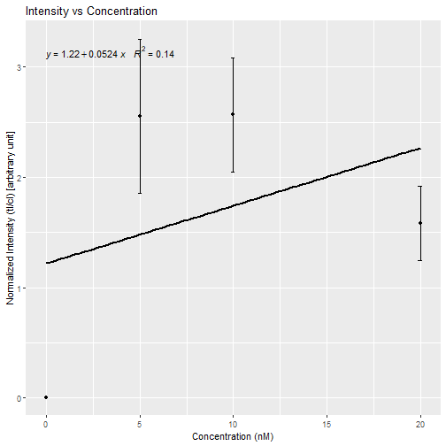
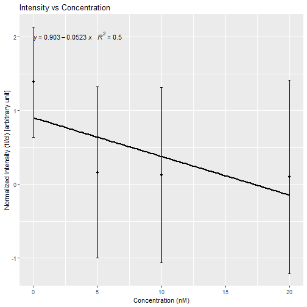

Analysis of the data of lateral flow assay
--------------------------------------------------------------

Date: 2019-08-29 23:28:20
-----------------------------------------

Initial Data:
-----------------------------------------

|Replicate_1 |Replicate_2 | Green_cl| Green_tl|   Red_cl|   Red_tl| Concentration|
|:-----------|:-----------|--------:|--------:|--------:|--------:|-------------:|
|E1          |R1          | 6526.983|    0.000| 6469.548|    0.000|             0|
|E1          |R1          | 6215.083|    0.000| 6134.012|    0.000|             5|
|E1          |R1          | 6227.790|    0.000| 7179.619|    0.000|            10|
|E1          |R1          | 6181.962|    0.000| 6338.376|    0.000|            20|
|E1          |R1          | 6039.891|    0.000| 6386.861|    0.000|            NA|
|E1          |R2          | 6167.497|    0.000| 8375.397|  795.406|            NA|
|E1          |R2          | 6112.719|    0.000| 8166.447|  774.113|            NA|
|E1          |R2          | 6157.426|    0.000| 8059.619|  722.284|            NA|
|E1          |R2          | 6114.497|    0.000| 8372.933|  693.577|            NA|
|E1          |R2          | 6086.669|    0.000| 8462.347|  736.577|            NA|
|E1          |R3          | 6064.012|    0.000| 8283.711|  686.577|            NA|
|E1          |R3          | 6612.205|    0.000| 8365.518|  595.042|            NA|
|E1          |R3          | 6132.376|    0.000| 8072.296|  730.284|            NA|
|E1          |R3          | 6030.841|    0.000| 8251.175|  689.175|            NA|
|E1          |R3          | 6396.447|    0.000| 8143.175|  733.820|            NA|
|E1          |R4          | 5856.719|    0.000| 8718.640|  505.456|            NA|
|E1          |R4          | 6062.255|    0.000| 8600.054|  645.284|            NA|
|E1          |R4          | 6228.134|    0.000| 8805.811|  621.284|            NA|
|E1          |R4          | 6023.841|    0.000| 8086.054|  582.577|            NA|
|E1          |R4          | 6194.619|    0.000| 8556.640|  603.284|            NA|
|E2          |R1          | 3640.326| 6066.255| 3401.962| 6564.669|            NA|
|E2          |R1          | 4013.397| 6105.062| 3530.447| 7128.933|            NA|
|E2          |R1          | 3968.497| 6131.426| 2897.619| 6389.154|            NA|
|E2          |R1          | 3360.790| 5886.134| 3124.083| 7300.983|            NA|
|E2          |R1          | 3675.397| 5820.184| 3837.104| 6221.205|            NA|
|E2          |R2          | 2572.205| 5873.548| 7853.447| 1550.134|            NA|
|E2          |R2          | 2887.569| 6189.184| 7832.276| 1514.770|            NA|
|E2          |R2          | 2636.255| 6371.962| 7608.296| 1727.648|            NA|
|E2          |R2          | 2429.497| 6030.305| 7767.104| 1860.598|            NA|
|E2          |R2          | 2735.376| 6246.598| 7922.347| 1965.770|            NA|
|E2          |R3          | 2186.790| 5984.255| 8735.761|  964.941|            NA|
|E2          |R3          | 2085.205| 6087.305| 8493.640|  885.284|            NA|
|E2          |R3          | 1821.719| 6041.841| 7947.347|  870.698|            NA|
|E2          |R3          | 1770.012| 6016.426| 7987.225|  929.820|            NA|
|E2          |R3          | 1960.134| 6073.305| 8343.761|  968.113|            NA|
|E2          |R4          | 2344.083| 6244.083| 8222.933|  827.234|            NA|
|E2          |R4          | 1737.619| 6183.376| 8404.589|  823.113|            NA|
|E2          |R4          | 1681.305| 6110.134| 8360.640|  816.820|            NA|
|E2          |R4          | 1971.497| 6492.719| 8135.225|  862.698|            NA|
|E2          |R4          | 2235.033| 6194.376| 8110.054|  786.991|            NA|
|E3          |R1          | 3478.326| 6229.255| 3984.184| 6319.376|            NA|
|E3          |R1          | 3309.740| 6256.305| 3961.406| 8062.326|            NA|
|E3          |R1          | 3492.861| 6286.770| 3634.669| 6992.790|            NA|
|E3          |R1          | 3176.497| 6103.891| 2822.891| 7263.225|            NA|
|E3          |R1          | 2939.326| 6153.770| 3259.355| 8016.912|            NA|
|E3          |R2          | 2009.426| 5957.234| 7980.468| 1171.698|            NA|
|E3          |R2          | 2213.962| 6189.598| 8040.933| 1171.062|            NA|
|E3          |R2          | 2167.669| 6084.598| 8580.296| 1296.062|            NA|
|E3          |R2          | 1738.012| 6230.426| 8514.347| 1614.527|            NA|
|E3          |R2          | 2120.669| 6165.598| 8328.004| 1256.184|            NA|
|E3          |R3          | 2734.447| 6172.376| 8483.711| 1089.113|            NA|
|E3          |R3          | 2518.255| 5990.355| 8024.225| 1082.527|            NA|
|E3          |R3          | 2568.790| 6529.669| 7943.690| 1179.234|            NA|
|E3          |R3          | 2609.205| 6047.184| 8153.761| 1160.184|            NA|
|E3          |R3          | 2489.790| 6295.740| 8633.711| 1292.184|            NA|
|E3          |R4          | 1994.376| 5998.184| 8734.953| 1070.527|            NA|
|E3          |R4          | 2639.326| 6638.669| 8248.054|  907.234|            NA|
|E3          |R4          | 1916.426| 6109.477| 8337.175|  943.234|            NA|
|E3          |R4          | 1942.012| 6417.719| 7831.811| 1146.598|            NA|
|E3          |R4          | 2293.497| 6281.376| 7993.347| 1038.820|            NA|
|E4          |R1          | 5840.861| 7117.841| 4366.841| 6819.054|            NA|
|E4          |R1          | 6657.104| 6433.305| 5125.083| 6512.790|            NA|
|E4          |R1          | 5788.054| 5786.770| 5001.811| 7640.589|            NA|
|E4          |R1          | 5712.033| 6698.790| 4808.205| 7012.569|            NA|
|E4          |R1          | 5359.376| 6204.305| 5515.255| 6871.790|            NA|
|E4          |R2          | 4500.983| 6991.790| 8397.004| 1478.719|            NA|
|E4          |R2          | 4267.397| 6353.719| 8574.882| 1552.527|            NA|
|E4          |R2          | 4004.154| 6790.083| 8672.125| 1657.426|            NA|
|E4          |R2          | 3914.912| 6560.962| 8176.397| 1472.305|            NA|
|E4          |R2          | 3636.083| 6185.841| 8877.832| 1674.305|            NA|
|E4          |R3          | 4314.811| 6503.841| 8739.761| 1536.598|            NA|
|E4          |R3          | 4487.397| 7100.740| 8177.589| 1532.255|            NA|
|E4          |R3          | 4155.154| 6848.548| 8544.004| 1472.719|            NA|
|E4          |R3          | 3506.619| 6355.255| 8110.246| 1205.577|            NA|
|E4          |R3          | 3851.276| 6494.669| 8578.296| 1440.184|            NA|
|E4          |R4          | 3378.983| 6286.255| 8537.489| 1091.820|            NA|
|E4          |R4          | 3151.326| 6149.184| 8363.054|  965.062|            NA|
|E4          |R4          | 2715.255| 6063.184| 8423.296|  943.770|            NA|
|E4          |R4          | 3504.912| 6541.305| 8198.640|  898.355|            NA|
|E4          |R4          | 2978.033| 5726.648| 7984.882|  878.648|            NA|

Combined replicates:
-----------------------------------------

| Green_NI| NI.sd.green|    Red_NI| NI.sd.red| Concn|
|--------:|-----------:|---------:|---------:|-----:|
| 0.000000|   0.0000000| 1.3877214| 0.7487078|     0|
| 2.553418|   0.7010468| 0.1627852| 1.1590601|     5|
| 2.566710|   0.5161048| 0.1265295| 1.1905701|    10|
| 1.585050|   0.3365106| 0.1021209| 1.3145894|    20|

Normalized Intensity Plot of Green QD (Normalized Intensity vs Concentration):
----------------------------------------------------------------

Normalized Intensity Plot of Red QD (Normalized Intensity vs Concentration):
----------------------------------------------------------------

95% Confidence Interval:
-------------------------------------------------------------

|          |  Min.Value| Max.Value|
|:---------|----------:|---------:|
|Conf_G_NI |  0.4679245|  2.884665|
|Conf_R_NI | -0.1843261|  1.073905|

Correlation:
--------------------------------------------------------------

|         | Correlation|
|:--------|-----------:|
|Cor_G_NI |   0.3703693|
|Cor_R_NI |   0.7102124|

LOD_First Method:
-----------------------------------------------------------------

| lod_ni_g| loq_ni_g| lod_ni_r| loq_ni_r|
|--------:|--------:|--------:|--------:|
|        0|        0| 3.633845|   8.8748|

LOD_Second Method:
-----------------------------------------------------------------

| lob_ni_g| lod_ni_g| loq_ni_g| lob_ni_r| lod_ni_r| loq_ni_r|
|--------:|--------:|--------:|--------:|--------:|--------:|
|        0| 1.153222|        0| 2.619346|    4.526|   8.8748|

Calculated Concentration:
-----------------------------------------------------------------

|  x|
|--:|
|  0|

Settings used during implementation:
--------------------------------------------
Select the type of file:  .txt 

Select the type of separation:  . 

Intensity value:  1 

Slope value:  1 

Intercept value:  1 

Session Information:
--------------------------------------------
R version 3.5.1 (2018-07-02)
Platform: x86_64-w64-mingw32/x64 (64-bit)
Running under: Windows >= 8 x64 (build 9200)

Matrix products: default

locale:
[1] LC_COLLATE=English_Germany.1252  LC_CTYPE=English_Germany.1252   
[3] LC_MONETARY=English_Germany.1252 LC_NUMERIC=C                    
[5] LC_TIME=English_Germany.1252    

attached base packages:
character(0)

other attached packages:
[1] Qplex_0.1.0

loaded via a namespace (and not attached):
 [1] tidyselect_0.2.4    locfit_1.5-9.1      purrr_0.2.5        
 [4] lattice_0.20-35     colorspace_1.3-2    htmltools_0.3.6    
 [7] yaml_2.2.0          grDevices_3.5.1     rlang_0.2.2        
[10] later_0.7.5         pillar_1.3.0        glue_1.3.0         
[13] withr_2.1.2         EBImage_4.22.1      BiocGenerics_0.26.0
[16] RColorBrewer_1.1-2  bindrcpp_0.2.2      jpeg_0.1-8         
[19] bindr_0.1.1         plyr_1.8.4          stringr_1.3.1      
[22] munsell_0.5.0       commonmark_1.5      gtable_0.2.0       
[25] htmlwidgets_1.2     evaluate_0.11       labeling_0.3       
[28] Biobase_2.40.0      knitr_1.20          httpuv_1.4.5       
[31] parallel_3.5.1      markdown_0.8        highr_0.7          
[34] methods_3.5.1       Rcpp_0.12.18        polynom_1.3-9      
[37] xtable_1.8-3        ggpmisc_0.3.0       promises_1.0.1     
[40] scales_1.0.0        jsonlite_1.5        abind_1.4-5        
[43] mime_0.5            ggplot2_3.0.0       stats_3.5.1        
[46] datasets_3.5.1      graphics_3.5.1      png_0.1-7          
[49] digest_0.6.17       stringi_1.1.7       tiff_0.1-5         
[52] dplyr_0.7.6         shiny_1.1.0         grid_3.5.1         
[55] tools_3.5.1         bitops_1.0-6        magrittr_1.5       
[58] lazyeval_0.2.1      RCurl_1.95-4.11     tibble_1.4.2       
[61] crayon_1.3.4        pkgconfig_2.0.2     xml2_1.2.0         
[64] utils_3.5.1         assertthat_0.2.0    base_3.5.1         
[67] roxygen2_6.1.0      rstudioapi_0.7      R6_2.2.2           
[70] fftwtools_0.9-8     compiler_3.5.1     
