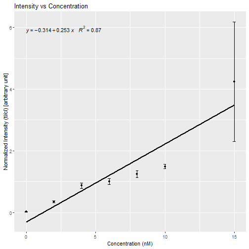
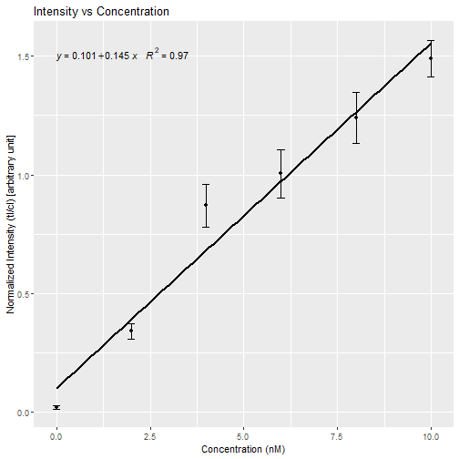
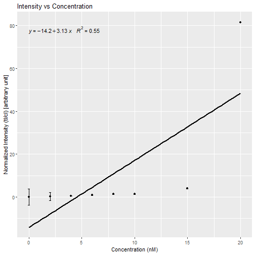
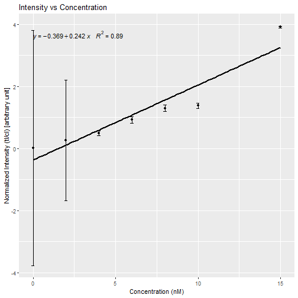
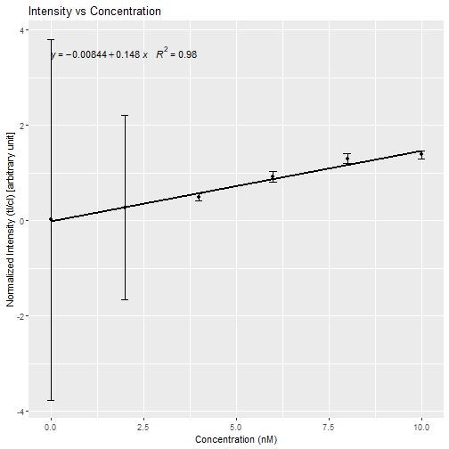

Analysis of the data of lateral flow assay
--------------------------------------------------------------

Date: 2019-08-31 13:14:37
-----------------------------------------

Initial Data of first file:
-----------------------------------------

|Replicate | Conc_CRP_Green| Conc_2_IL6_Red|  Green_cl|  Green_tl|    Red_cl|    Red_tl|
|:---------|--------------:|--------------:|---------:|---------:|---------:|---------:|
|R1        |              0|             20| 20064.974|   918.920|   379.192| 22314.024|
|R1        |              2|             15| 20275.146|   988.005|   344.192| 21818.903|
|R1        |              4|             10| 19459.610|  1035.163|   358.192| 20625.489|
|R2        |              6|              8| 22731.681|  2813.205|  9124.660| 19503.246|
|R2        |              8|              6| 21348.974|  2603.326|  8413.004| 19588.368|
|R2        |             10|              4| 21251.681|  2708.033|  8593.246| 19766.489|
|R3        |             15|              2| 23611.388|  4498.104| 23079.731| 16631.000|
|R3        |             20|              0| 23757.560|  4401.961| 22795.610| 16219.368|
|R3        |             NA|             NA| 23089.681|  4321.861| 23249.853| 16527.075|
|R4        |             NA|             NA| 18250.953| 11649.489| 18568.660| 14345.953|
|R4        |             NA|             NA| 15819.589| 11573.903| 15658.589| 14136.368|
|R4        |             NA|             NA| 18254.075| 11638.196| 16900.711| 13165.711|
|R5        |             NA|             NA| 20806.204| 15596.903| 20733.782| 10956.518|
|R5        |             NA|             NA| 20164.388| 14489.539| 20569.782| 10587.347|
|R5        |             NA|             NA| 20702.731| 14818.539| 21542.610| 11321.004|
|R6        |             NA|             NA| 23276.240| 20396.368| 23562.196|  6554.740|
|R6        |             NA|             NA| 25260.924| 20145.903| 27061.924|  6913.690|
|R6        |             NA|             NA| 25474.803| 20675.903| 26994.510|  6859.397|
|R7        |             NA|             NA| 18782.246| 20237.489| 20384.539|  6983.276|
|R7        |             NA|             NA|  5455.811| 20229.903| 20125.903|  2984.134|
|R7        |             NA|             NA|  5176.104| 20088.903| 18859.075|  2934.134|
|R8        |             NA|             NA|   622.263| 17123.418| 19410.368|   442.607|
|R8        |             NA|             NA|   707.678| 18771.368| 19766.369|   399.021|
|R8        |             NA|             NA|   700.678| 19758.782| 19845.075|   493.021|

Initial Data of second file:
-----------------------------------------

|Replicate | Conc_CRP_Green| Conc_2_IL6_Red|  Green_cl|  Green_tl|    Red_cl|    Red_tl|
|:---------|--------------:|--------------:|---------:|---------:|---------:|---------:|
|R1        |             20|             20|  1005.163| 19630.217|  1747.163| 20629.903|
|R1        |             15|             15|   600.092| 20041.317|     0.000| 19305.953|
|R1        |             10|             10|   665.920| 17384.853|     0.000| 17016.924|
|R2        |              8|              8|  1710.305| 18886.439|  1128.820| 18878.796|
|R2        |              6|              6|  1865.134| 18272.027|  1089.991| 17615.024|
|R2        |              4|              4|  1837.184| 21038.024|  1118.991| 19929.075|
|R3        |              2|              2|  5137.930| 19324.317|  4151.104| 20483.803|
|R3        |              0|              0| 11541.075| 24660.191|  6436.347| 24930.726|
|R3        |             NA|             NA|  5250.347| 20758.489|  3807.983| 20508.075|
|R4        |             NA|             NA|  7769.054| 13236.045|  6983.933| 18340.258|
|R4        |             NA|             NA| 12825.418| 17117.744|  6114.569| 14983.673|
|R4        |             NA|             NA|  8479.468| 19019.217|  6928.690| 17283.924|
|R5        |             NA|             NA| 12536.125| 16876.995| 11169.882| 15878.158|
|R5        |             NA|             NA| 19411.317| 20342.111| 15398.539| 30278.266|
|R5        |             NA|             NA| 19249.196| 15031.522| 10398.468| 13967.643|
|R6        |             NA|             NA| 17613.660| 11478.936| 18388.125| 15891.049|
|R6        |             NA|             NA| 18256.246| 10339.078| 17389.468| 12553.070|
|R6        |             NA|             NA| 18619.368| 17832.418| 18130.296| 16232.832|
|R7        |             NA|             NA| 18601.368|  5994.116| 19769.782|  7320.815|
|R7        |             NA|             NA| 18900.903|  5715.995| 18407.539|  7517.865|
|R7        |             NA|             NA| 18620.660|  3505.903| 17849.125|  3717.803|
|R8        |             NA|             NA| 22875.560|   916.335| 21532.196|   409.385|
|R8        |             NA|             NA| 20135.489|   306.021| 19112.125|     0.000|
|R8        |             NA|             NA| 20733.024|   253.728| 19728.246|     0.000|

Combined replicates:
-----------------------------------------

|   Green_NI| NI.sd.green|     Red_NI| NI.sd.red| Conc_CRP_Green| Conc2_IL6_Red|
|----------:|-----------:|----------:|---------:|--------------:|-------------:|
|  0.0205698|   0.0082633| 81.5894617| 0.0082633|              0|            20|
|  0.3408328|   0.0315569|  3.9151336| 0.0315569|              2|            15|
|  0.8702184|   0.0912528|  1.3798064| 0.0912528|              4|            10|
|  1.0049597|   0.1015720|  1.2981401| 0.1015720|              6|             8|
|  1.2404445|   0.1087541|  0.9229998| 0.1087541|              8|             6|
|  1.4907119|   0.0766078|  0.4949105| 0.0766078|             10|             4|
|  4.2450039|   1.9401132|  0.2699939| 1.9401132|             15|             2|
| 27.3814241|   3.7899706|  0.0145104| 3.7899706|             20|             0|

Normalized Intensity Plot of Green QD (Normalized Intensity vs Concentration):
----------------------------------------------------------------

Normalized Intensity Plot of Green QD (0 - 15 nM) (Normalized Intensity vs Concentration):
----------------------------------------------------------------

Normalized Intensity Plot of Green QD (0 - 10 nM) (Normalized Intensity vs Concentration):
----------------------------------------------------------------

Normalized Intensity Plot of Red QD (Normalized Intensity vs Concentration):
----------------------------------------------------------------

Normalized Intensity Plot of Red QD (0 - 15 nM) (Normalized Intensity vs Concentration):
----------------------------------------------------------------

Normalized Intensity Plot of Red QD (0 - 10 nM) (Normalized Intensity vs Concentration):
----------------------------------------------------------------

95% Confidence Interval:
-------------------------------------------------------------

|          | Min.Value| Max.Value|
|:---------|---------:|---------:|
|Conf_G_NI | -2.005002|  11.15354|
|Conf_R_NI | -8.883693|  31.35493|

95% Confidence Interval (0 - 15 nM):
-------------------------------------------------------------

|          | Min.Value| Max.Value|
|:---------|---------:|---------:|
|Conf_G_NI | 0.2677578|  2.364454|
|Conf_R_NI | 0.1967325|  2.173409|

95% Confidence Interval (0 - 10 nM):
-------------------------------------------------------------

|          | Min.Value| Max.Value|
|:---------|---------:|---------:|
|Conf_G_NI | 0.3760462|  1.279866|
|Conf_R_NI | 0.2738324|  1.186288|

Correlation:
--------------------------------------------------------------

|         | Correlation|
|:--------|-----------:|
|Cor_G_NI |   0.7964128|
|Cor_R_NI |   0.5167744|

Correlation (0 - 15 nM):
--------------------------------------------------------------

|         | Correlation|
|:--------|-----------:|
|Cor_G_NI |   0.9311908|
|Cor_R_NI |   0.8247791|

Correlation (0 - 10 nM):
--------------------------------------------------------------

|         | Correlation|
|:--------|-----------:|
|Cor_G_NI |   0.9835558|
|Cor_R_NI |   0.9890482|

LOD_First Method:
-----------------------------------------------------------------

|  lod_ni_g|  loq_ni_g| lod_ni_r| loq_ni_r|
|---------:|---------:|--------:|--------:|
| 0.0453598| 0.1032031| 11.38442| 37.91422|

LOD_Second Method:
-----------------------------------------------------------------

| lob_ni_g|  lod_ni_g|  loq_ni_g| lob_ni_r| lod_ni_r| loq_ni_r|
|--------:|---------:|---------:|--------:|--------:|--------:|
| 0.034163| 0.0860741| 0.1032031| 6.249012| 9.440498| 37.91422|

Calculated Concentration:
-----------------------------------------------------------------

|  x|
|--:|
|  0|

Settings used during implementation:
--------------------------------------------
Select the type of file:  .csv 

Select the type of separation for file1:  , 

Select the type of separation for file1:  , 

Intensity value:  1 

Slope value:  1 

Intercept value:  1 

Session Information:
--------------------------------------------
R version 3.5.1 (2018-07-02)
Platform: x86_64-w64-mingw32/x64 (64-bit)
Running under: Windows >= 8 x64 (build 9200)

Matrix products: default

locale:
[1] LC_COLLATE=English_Germany.1252  LC_CTYPE=English_Germany.1252   
[3] LC_MONETARY=English_Germany.1252 LC_NUMERIC=C                    
[5] LC_TIME=English_Germany.1252    

attached base packages:
character(0)

other attached packages:
[1] Qplex_0.1.0

loaded via a namespace (and not attached):
 [1] tidyselect_0.2.4    locfit_1.5-9.1      purrr_0.2.5        
 [4] lattice_0.20-35     colorspace_1.3-2    htmltools_0.3.6    
 [7] yaml_2.2.0          grDevices_3.5.1     rlang_0.2.2        
[10] later_0.7.5         pillar_1.3.0        glue_1.3.0         
[13] withr_2.1.2         EBImage_4.22.1      BiocGenerics_0.26.0
[16] RColorBrewer_1.1-2  bindrcpp_0.2.2      jpeg_0.1-8         
[19] bindr_0.1.1         plyr_1.8.4          stringr_1.3.1      
[22] munsell_0.5.0       commonmark_1.5      gtable_0.2.0       
[25] htmlwidgets_1.2     evaluate_0.11       labeling_0.3       
[28] Biobase_2.40.0      knitr_1.20          Cairo_1.5-10       
[31] httpuv_1.4.5        parallel_3.5.1      markdown_0.8       
[34] highr_0.7           methods_3.5.1       Rcpp_0.12.18       
[37] polynom_1.3-9       xtable_1.8-3        promises_1.0.1     
[40] scales_1.0.0        ggpmisc_0.3.0       jsonlite_1.5       
[43] abind_1.4-5         mime_0.5            ggplot2_3.0.0      
[46] stats_3.5.1         datasets_3.5.1      graphics_3.5.1     
[49] png_0.1-7           digest_0.6.17       stringi_1.1.7      
[52] tiff_0.1-5          dplyr_0.7.6         shiny_1.1.0        
[55] grid_3.5.1          tools_3.5.1         bitops_1.0-6       
[58] magrittr_1.5        lazyeval_0.2.1      RCurl_1.95-4.11    
[61] tibble_1.4.2        crayon_1.3.4        pkgconfig_2.0.2    
[64] xml2_1.2.0          utils_3.5.1         assertthat_0.2.0   
[67] base_3.5.1          roxygen2_6.1.0      rstudioapi_0.7     
[70] R6_2.2.2            fftwtools_0.9-8     compiler_3.5.1     
